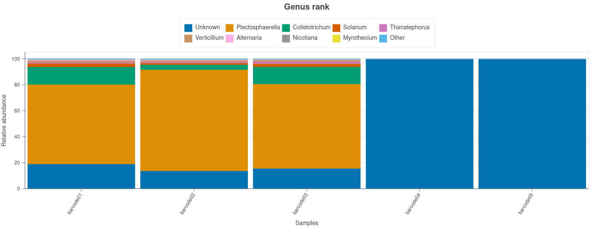

# Comparing Savont to EPI2ME wf-16s workflow

Ramon Reilman

This file will contain an overview of what I've done to compare these 2 workflows, and the results of that. Since the code takes up a lot of space, I moved all of these code blocks to the end of the report

## Methods / tools / code

I compared these 2 tools using 3 different types of data.

1. Potato data from Thomas
2. A Gutmock dataset from zymo
3. Simulated data using nanosim

### Scope and comparison
Quantitative comparison via OPAL is only possible for the simulated dataset, because OPAL requires ground-truth profiles in a taxonomy shared by both tools. Potato and GutMock data are presented as qualitative observations only, they reveal behavioral differences that complement, but do not replace, the benchmark.
### Potato data
I ran the wf-16s on the potato data (From Thomas Vogel), using less processes and a small queue size due to it crashing otherwise. Running it with a lower max_len value caused the results to be empty, so this was a necessary step. It was run using the Silva database, the same one as Savont. (Shaw et al., n.d.). Classifications were generated via minimap2 alignment (Li, 2018)

(Code Block 1)

These same values (like max length) were kept for Savont, to keep it equal.
(Code Block 2)

### GutMock

For the gutmock I had to first turn the bam files into fasta files: (Code Block 3)

And I had to remove the adapters that were on the data: (Code Block 4)

After this I was able to use both wf-16s and Savont on the data. (Code Block 5)

### Simulated data

While both Savont and wf-16s ran and on the GutMock and potato data, there was no accurate way to compare these 2 tools for the following reasons:

1. We don't know what the exact microbiome is of real sequenced data (at least not in this case). This causes real data, like the potato dataset, to be inherently useless for comparing the 2 tools. So I read about the mock datasets (like gutmock), this however came with different issues.
2. Most, if not all, mock datasets that I found (like the gutmock dataset) have their ground truth values using NCBI tax ID's or NCBI naming conventions, whereas Gereengenes2 (McDonald et al., 2024) uses GTDB-based taxonomy (Parks et al., 2018, 2020). Savont, at this moment, does not support an NCBI reference database. Since both tools need the same reference database, I could not use the NCBI for wf-16s, and another for Savont. This meant I had to generate a fake mock dataset using NanoSim (Yang et al., 2017), using a database that both

3. OPAL (Meyer et al., 2019), the tools used to compare Savont and wf-16s, requires the input data to have two important things:
	- All input files need to have the CAMI Profiling output (Sczyrba et al., 2017) (version 0.9.3) https://github.com/bioboxes/rfc/blob/60263f34c57bc4137deeceec4c68a7f9f810f6a5/data-format/profiling.mkd
	- These input files need to contain TAXids. The issue with this is that I could not find any valid TAXids for the greengenes2 db (the only reference db that Savont and wf-16s share). So I had to generate my own TAXid database for greengenes2
	
4. The Savont greengenes2 db and wf-16s are not the same, the wf-16s version is a plus version that contains more species than the Savont version. To fix this I updated my own tool, that is able to generate a custom db for wf-16s, that is based on the Savont db. Using my own TAXids that were defined in the third point.

### Generating Simulated data

One of the first steps I had to do was split the Savont database. (Code Block 6)

I had made the choice to make my simulated dataset comparable to my gutmock dataset, planning to use the following species (named according to GTDB taxonomy, which Greengenes2 uses; Parks et al., 2018, 2020):

Bacteroides_H_857956 fragilis
Faecalibacterium prausnitzii
Veillonella_A rogosae
Prevotella corporis
Clostridioides_A difficile
Roseburia_A_166204 hominis
Fusobacterium_C animalis
Bifidobacterium_388775 adolescentis
Escherichia albertii
Limosilactobacillus fermentum
Escherichia sonnei
Escherichia ruysiae
Escherichia boydii
Akkermansia muciniphila_D_776786
Escherichia dysenteriae
Bifidobacterium_388775 faecale
Salmonella bongori

The TAXids for these species were already in my reference db at this point, so it was the easiest way to build new data. (Code Block 7)

This moves all of the files that contain sequences belonging to species in the species list to a different folder, that will contain the custom set of species.

The headers in these files are duplicated, this is something that NanoSim does not want, so I have to change these. The command below does the following:

Loops through all files, replaces their name with an ID (from my own taxid db) (Code Block 8)

This caused headers in the training sets to look like this: "\>58_c021" with 58 being the species taxID and the c021, the sequence id.

After training the data on the gutmock replicate 1, it revealed to me that the sequences my model had been trained with were too long, so I made the input file for this contain shorter sequences: (Code Block 9)

Running NanoSim without this step caused it to create new abundances with very high deviations from my expected abundances, in some cases even 2 or 3 orders of magnitude. Investigating this issue led met to NanoSim pull request #232, a fix for abundance deviation in metagenome mode (Yang et al., 2021).

When a drawn read length exceeds the chosen reference sequence, NanoSim will fall back to a randomly selected sequence from the entire reference pool, if this happens enough times, the eventual true abundances will deviate from the input abundances. I ended up fixing this issue by limiting the length of sequences in the rep1 data, as seen above.

I could not change the median, sd, or max length of NanoSim later downstream. This was because anytime I used these flags, NanoSim would hang, seemingly indefinitely. This matches another known issue on the repo (#185). Only the species with lower abundance showed a slight deviation at the end, but nothing that is not negligible.

This range was chosen due to the input species files having sequences in this length range.

This could now be used to train a model (Code Block 10)

And that model could now be used to generate data (Code Block 11)

(Code Block 12)

### Running Savont and wf-16s

One of the last issues now was that both wf-16s and Savont don't use the same greengenes2 version, a fix for this was built into my python library that is being built for this project: https://github.com/RamonReilman/SavontAnalysis 
(Code Block 13)

This generates the following files:

- Gg2_renamed.fa, a fasta file with sequences, now with headers that have a ggX (so the first sequence is gg0). With their lineage: "\>gg0 d__Bacteria;p__Bacillota_A_368345;c__Clostridia_258483;o__Lachnospirales;f__Lachnospiraceae;g__Eubacterium_G_180878;s__ventriosum" for the first sequence in the file.
- Ref2taxid.tsv, maps these ggX id's to the fitting TAXids from my custom database
- Names.dmp, contains all names (and TAXids) for my entire db
- Nodes.dmp, contains all TAXids, taxonomic ranks, and parental TAXids for entire db

These files could now be used to run the wf-16s workflow (Code Block 14)

(Code Block 15)

(Code Block 16)

These files can now be transformed into the CAMI taxonomic standard with my library: (Code Block 17)

(Code Block 18)

(Code Block 19)

And can then be used as in input for OPAL: (Code Block 20)

## Results

### Potato-data

#### WF-16s
Running a taxonomic profile classification with the EPI2ME 16s workflow resulted in the following genera being found in the barcodes. 

Figure 1, the relative abundances of genera in the different potato samples generated by the wf-16s workflow.
Barcodes 4 and 5 being completely unknown is very much note worthy, as Savont (below) does find genera in these datasets.

#### Savont
Running a taxonomic profile classification with the Savont resulted in the following genera being found in the barcodes. 

Figure 2, relative abundance of genera in the potato data, generated by Savont.
The amount of Unknown or unclassified values is very low, especially compared to that found in the wf-16s results. Savont and wf-16s also find different genera, but since the ground truth of this is unknown, I do not know what tool is more correct.
### GutMock data

#### WF-16s
Running a taxonomic profile classification with the EPI2ME 16s workflow resulted in the following genera being found in the barcodes. 

Figure 3, relative abundance of genera in replicate 2 of the gutmock dataset, generated by the wf-16s workflow
I've left out the other 3 images for the other replicates, as they were all more or less the same. There is a pretty low percentage that is not defined.
#### Savont

Figure 4, relative abundance of genera in replicate 2 of the gutmock dataset, generated by Savont

The 4 replicates within this dataset are more or less completely the same. And we can even note that both wf-16s and Savont find a comparable composition of genera in the data.
### Generated Data

Table 1, Important metrics for every taxonomic rank (if available), between Savont and wf-16s.

| Metric                           | Rank                      | Savont | wf-16s |
| -------------------------------- | ------------------------- | ------ | ------ |
| Detection (F1-score)             | Phylum                    | 1.000  | 1.000  |
| Detection (F1-score)             | Class                     | 1.000  | 1.000  |
| Detection (F1-score)             | Order                     | 1.000  | 1.000  |
| Detection (F1-score)             | Family                    | 1.000  | 1.000  |
| Detection (F1-score)             | Genus                     | 0.957  | 1.000  |
| Detection (F1-score)             | Species                   | 0.786  | 0.850  |
| Purity                           | Genus                     | 1.000  | 1.000  |
| Purity                           | Species                   | 1.000  | 0.739  |
| Completeness                     | Genus                     | 0.917  | 1.000  |
| Completeness                     | Species                   | 0.647  | 1.000  |
| Abundance accuracy (Bray-Curtis) | Phylum                    | 0.008  | 0.788  |
| Abundance accuracy (Bray-Curtis) | Class                     | 0.008  | 0.788  |
| Abundance accuracy (Bray-Curtis) | Order                     | 0.018  | 0.788  |
| Abundance accuracy (Bray-Curtis) | Family                    | 0.027  | 0.788  |
| Abundance accuracy (Bray-Curtis) | Genus                     | 0.035  | 0.788  |
| Abundance accuracy (Bray-Curtis) | Species                   | 0.050  | 0.791  |
| Abundance accuracy (L1)          | Phylum                    | 0.015  | 0.882  |
| Abundance accuracy (L1)          | Class                     | 0.015  | 0.882  |
| Abundance accuracy (L1)          | Order                     | 0.035  | 0.882  |
| Abundance accuracy (L1)          | Family                    | 0.052  | 0.882  |
| Abundance accuracy (L1)          | Genus                     | 0.069  | 0.882  |
| Abundance accuracy (L1)          | Species                   | 0.096  | 0.884  |
| Sum of abundance                 | Phylum                    | 0.989  | 0.118  |
| Sum of abundance                 | Species                   | 0.924  | 0.118  |
| Other                            | Weighted UniFrac error    | 0.0024 | 0.0800 |
| Other                            | Unweighted UniFrac error  | 0.204  | 0.538  |
| Other                            | Weighted UniFrac (CAMI)   | 0.310  | 0.799  |
| Other                            | Unweighted UniFrac (CAMI) | 34.0   | 64.00  |

2 important metrics to discuss are purity and completeness.

Savont at the species level does not find any false positives (purity of 1), whereas wf-16s has a lower purity, and thus finds false positives. The completeness on the other hand is a bit lower for Savont, it does not find all species in the ground truth. The completeness for WF-16s is 1, meaning it has found all species that the ground truth expected. I am curious to see if we can possibly lower the amount of missing species in Savont.

The sum of abundance for wf-16s is extremely low (about 11%). I tried to lower the `--min_ref_coverage` (a minimap2 alignment parameter; Li, 2018) from 90 to 70, which did increase the sum of abundance, but lowered the purity:

#### Purity

| Rank | Savont | wf-16s |
|---|---|---|
| Genus | 1.0 | 1.0 |
| Species | 1.0 | 0.68 |

#### Sum of abundance
- Previously: 11.8%
- Now: 52%

I could not seem to increase or decrease the species completeness for Savont two. After looking into what caused this lower completeness I found the following in the asv mapping file:

final_asv_69_depth_429 100.00% g__Escherichia; -> Greengenes_unannotated
final_asv_69_depth_429 100.00% g__Escherichia;s__albertii; -> Escherichia albertii

Savont's species-level misses are explained by unresolved ties between correct matching named-species references and incompletely-annotated genus-only records present in the Greengenes2 database itself. The 2 lines above (from asv_mappings.tsv) (ASV 69, ASV 71) shows the same ASV achieving 100% identity against both a named species and an unannotated genus-only record at the same time, with inconsistent resolution of the tie. I was unsure if this was intended behavior, so I talked to the developer who said the following:

"Here's how savont actually deals with tie breaks right now, which is a bit poorly documented and may be useful to know:

1. Each ASV gets mapped to the reference database. All unambiguously best hits are pooled together for each ASV.
2. We look at the best hits across all ASVs, and then prefer taxonomy that are seen commonly across all ASVs.

This is done for the following reason: suppose a genome has two 16S copies, with two corresponding ASVs. ASV 1 may map perfectly to two different species, whereas ASV 2 unambiguously maps to the correct species. In this case, we'll assign both ASVs to the correct species.

This has a corollary that if many references are called "g_....; unannotated", it'll prefer the unannotated, since it's seen a lot." - bluenote-1577.

### Time to Run
There was a very big difference in the time the tools took to run:
In general Savont was extremely fast, usually taking (all steps including downloading a db) no more than 15 minutes. The EPI2ME workflow was considerably slower, taking an hour and 13 minutes for the simulated data. This trend was followed for all data, Savont is faster than wf-16s is. 

## Conclusions / discussion
Across all 3 datasets Savont and wf-16s show a consistent trade-off rather than one tool being better than the other.

On the simulated dataset, the set with a known true ground truth, Savont appeared to be the most precise tool: It has a very high species purity, meaning every species it finds within the data is actually a species in the data. It reconstructs abundance in a very accurate way (more accurate than wf-16s at every rank), this can be seen by it having both a lower Abundance accuracy (Bray-Curtis) and L1 value. WF-16s is more complete, it finds every species present in the ground truth (a completeness of 1), where Savont misses some (completeness of 0.647). The purity of WF-16s is lower, being around 0.739, this means it calls out species that are not actually present. Its sum of abundances is also extremely low (0.118 at species level), this indicates that a majority of the classified reads are not being connected to any of the true species.

I investigated both shortcomings. I got the sum of abundances to increase to 52% by lowering the `--min_rev_coverage` from 90 -> 70. This caused the purity of the results to drop, finding 8 false positives now, instead of 6. (0.739 -> 0.68). This confirms a completeness and purity trade-off within the tool. Savont species level misses trace back to a specific previously undocumented behavior: When an ASV matches both a named species and a unannotated genus-only greengenes2 record with an *equal* identity, Savonts tie-breaking logic can resolve in favor of the unannotated genus entry, if that pattern is seen frequently across other ASVs.

Finally, Savont was consistently faster across every dataset. 

One limitation of this comparison is worth noting: due to NanoSim behavior (details above in methods), species with short greengenes2 16S sequences were a bit underrepresented. While the actual composition with abundances is fully known, it could have lost some statistical power for the lowest-abundance species. Future work could address this by sourcing additional, longer reference sequences for the affected species, or by resolving the NanoSim length-override hang (GitHub issue #185) to allow direct control of the simulated read-length distribution.

All in all, **Savont seems to be a more conservative, precise, and faster tool. It has an accurate abundance quantification and low false-positve rates. WF-16s is more sensitive and complete, at the cost of precision, abundance accuracy, and speed.** 

# Sources
Li, H. (2018). Minimap2: Pairwise alignment for nucleotide sequences. _Bioinformatics_, _34_(18), 3094–3100. [https://doi.org/10.1093/bioinformatics/bty191](https://doi.org/10.1093/bioinformatics/bty191)

McDonald, D., Jiang, Y., Balaban, M., Cantrell, K., Zhu, Q., Gonzalez, A., Morton, J. T., Nicolaou, G., Parks, D. H., Karst, S. M., Albertsen, M., Hugenholtz, P., DeSantis, T., Song, S. J., Bartko, A., Havulinna, A. S., Jousilahti, P., Cheng, S., Inouye, M., … Knight, R. (2024). Greengenes2 unifies microbial data in a single reference tree. _Nature Biotechnology_, _42_, 715–718. [https://doi.org/10.1038/s41587-023-01845-1](https://doi.org/10.1038/s41587-023-01845-1)

Meyer, F., Bremges, A., Belmann, P., Janssen, S., McHardy, A. C., & Koslicki, D. (2019). Assessing taxonomic metagenome profilers with OPAL. _Genome Biology_, _20_, 51. [https://doi.org/10.1186/s13059-019-1646-y](https://doi.org/10.1186/s13059-019-1646-y)

Parks, D. H., Chuvochina, M., Chaumeil, P.-A., Rinke, C., Mussig, A. J., & Hugenholtz, P. (2020). A complete domain-to-species taxonomy for Bacteria and Archaea. _Nature Biotechnology_, _38_, 1079–1086. [https://doi.org/10.1101/771964](https://doi.org/10.1101/771964)

Parks, D. H., Chuvochina, M., Waite, D. W., Rinke, C., Skarshewski, A., Chaumeil, P.-A., & Hugenholtz, P. (2018). A standardized bacterial taxonomy based on genome phylogeny substantially revises the tree of life. _Nature Biotechnology_, _36_, 996–1004. [https://doi.org/10.1101/256800](https://doi.org/10.1101/256800)

Sczyrba, A., Hofmann, P., Belmann, P., Koslicki, D., Janssen, S., Dröge, J., Gregor, I., Majda, S., Fiedler, J., Dahms, E., Bremges, A., Fritz, A., Garrido-Oter, R., Jørgensen, T. S., Shapiro, N., Blood, P. D., Gurevich, A., Bai, Y., Turaev, D., … McHardy, A. C. (2017). Critical Assessment of Metagenome Interpretation—A benchmark of metagenomics software. _Nature Methods_, _14_(11), 1063–1071. [https://doi.org/10.1038/nmeth.4458](https://doi.org/10.1038/nmeth.4458)

Shaw, J., Riisgaard-Jensen, M., Andersen, K. S., Kirkegaard, R., Dueholm, M. K. D., & Li, H. (n.d.). Sensitive long-read amplicon sequence variant recovery with savont. _bioRxiv_. Retrieved [https://www.biorxiv.org/content/10.64898/2026.05.26.727271.full.pdf](https://www.biorxiv.org/content/10.64898/2026.05.26.727271.full.pdf)

Yang, C., Chu, J., Warren, R. L., & Birol, I. (2017). NanoSim: Nanopore sequence read simulator based on statistical characterization. _GigaScience_, _6_(4). [https://doi.org/10.1101/044545](https://doi.org/10.1101/044545)

Yang, C., Lo, T., Nip, K. M., Hafezqorani, S., Warren, R. L., & Birol, I. (2021). Characterization and simulation of metagenomic nanopore sequencing data with Meta-NanoSim. _bioRxiv_. [https://doi.org/10.1101/2021.11.19.469328](https://doi.org/10.1101/2021.11.19.469328)
# Appendix: Commands

**Code Block 1**
```bash
nextflow run epi2me-labs/wf-16s \
--fastq /home/hackllab/for-ramon/potato-fungi-18S-20260817/fastq_pass/ \
--out_dir /home/ramon/output/runs_out/potato/next \
--classifier minimap2 \
-with-apptainer \
-without-docker \
-process.maxForks 1 \
 -queue-size 1 \
--database_set SILVA_138_1 \
--max_len 4000 \
--threads 2
```

**Code Block 2**
```bash
savont asv --pooled-samples \
/home/hackllab/for-ramon/potato-fungi-18S-20260817/fastq_pass/barcode01/FBH02060_pass_barcode01_10104705_00000000_0.fastq \
/home/hackllab/for-ramon/potato-fungi-18S-20260817/fastq_pass/barcode02/FBH02060_pass_barcode02_10104705_00000000_0.fastq \
/home/hackllab/for-ramon/potato-fungi-18S-20260817/fastq_pass/barcode03/FBH02060_pass_barcode03_10104705_00000000_0.fastq \
/home/hackllab/for-ramon/potato-fungi-18S-20260817/fastq_pass/barcode04/FBH02060_pass_barcode04_10104705_00000000_0.fastq \
/home/hackllab/for-ramon/potato-fungi-18S-20260817/fastq_pass/barcode05/FBH02060_pass_barcode05_10104705_00000000_0.fastq \
-o /home/ramon/output/runs_out/potato/savont_asv/ \
-M 4000 \
-t 5

savont classify -i /home/ramon/output/runs_out/potato/savont_asv/ -o /home/ramon/output/runs_out/potato/savont_tax/ -d /home/ramon/savont_db/silva-138.2 -t 4
```

**Code Block 3**
```bash
dir=/home/hackllab/for-ramon/GutMock_sup/
mkdir -p "$dir"
for file in /home/hackllab/for-ramon/zymo_16s_2025.09/GutMock/MAB114/sup/*; do
file_name=$(basename "$file")
bedtools bamtofastq -i "$file"/*.bam -fq /dev/stdout > "$dir"/"$file_name".fastq
done
```

**Code Block 4**
```bash
outpt=/home/hackllab/for-ramon/gutmock_out_sup/trimmed
mkdir -p "$outpt"
for file in /home/hackllab/for-ramon/GutMock_sup/*; do
file_name=$(basename "$file")
cutadapt -g 'AGRGTTYGATYMTGGCTCAG' -a 'SGGYTACCTTGTTACGACTT' -O 15 -e 0.1 --report=full -o "$outpt"/"$file_name" "$file"
done
```

**Code Block 5**
```bash
for rep in rep1 rep2 rep3 rep4; do
nextflow run epi2me-labs/wf-16s \
--fastq "/home/hackllab/for-ramon/gutmock_out_sup/trimmed/${rep}.fastq" \
--out_dir /home/ramon/output/runs_out/gutmock_nf_sup/${rep}/ \
--sample "$rep" \
--classifier minimap2 \
-with-apptainer \
-without-docker \
--database_set SILVA_138_1 \
--threads 4
done

savont asv --pooled-samples \
/home/hackllab/for-ramon/gutmock_out_sup/trimmed/rep1.fastq \
/home/hackllab/for-ramon/gutmock_out_sup/trimmed/rep2.fastq \
/home/hackllab/for-ramon/gutmock_out_sup/trimmed/rep3.fastq \
/home/hackllab/for-ramon/gutmock_out_sup/trimmed/rep4.fastq \
-o /home/ramon/output/runs_out/gutmock_nf_sup/savont_asv/ \
-t 5

savont classify -i /home/ramon/output/runs_out/gutmock_nf_sup/savont_asv/ -o /home/ramon/output/runs_out/gutmock_nf_sup/savont_taxo/ -d /home/ramon/savont_db/silva-138.2 -t 4
```

**Code Block 6**
```bash
seqkit split -i /home/ramon/savont_db/greengenes2-2024.09/gg2_2024_09_toSpecies_trainset.fa
```

**Code Block 7**
```bash
SPECIES_LIST="/home/ramon/species_list.txt"
cd /home/ramon/savontdb/greengenes2-2024.09
while IFS=" " read genus species; do
	file_wanted=(find ./ -iname "*genus" -iname "species*")
	cp $file_wanted /home/ramon/custom_set/"genus""species".fasta
done < "SPECIES_LIST"
```

**Code Block 8**
```bash
mkdir -p /home/ramon/custom_set/clean
cd /home/ramon/custom_set
: > genome_list.tsv
: > id_lineage.tsv

while read -r id path; do
path="{path/#\~/HOME}"
seqkit seq -m 1300 -M 1700 "$path"
| seqkit sample -n 30 -s 42
| seqkit replace -p '.+' -r 'c{nr}' --nr-width 3 \
> clean/id.fasta
printf '%s\t%s\n' "id" "/home/ramon/custom_set/clean/id.fasta" >> genome_list.tsv
printf '%s\t%s\n' "id" "(seqkit seq -n "path" | head -1)" >> id_lineage.tsv
done < /home/ramon/savont_db/greengenes2-2024.09/genome_list.txt

for f in clean/*.fasta; do
id=(basename "f" .fasta)
seqkit replace -p '^' -r "{id}_" "f"
done > train_ref.fasta
```

**Code Block 9**
```bash
seqkit seq -m 1300 -M 1500 /home/hackllab/for-ramon/GutMock_sup/rep1.fastq > /home/hackllab/for-ramon/GutMock_sup/rep1_short.fastq
```

**Code Block 10**
```bash
python3 /home/ramon/tools/NanoSim/src/read_analysis.py genome -i /home/hackllab/for-ramon/GutMock_sup/rep1_short.fastq -rg /home/ramon/custom_set/train_ref.fasta -o ~/models/dept_model_v2 --fastq -t 4
```

**Code Block 11**
```bash
python3 /home/ramon/tools/NanoSim/src/simulator.py metagenome -gl /home/ramon/custom_set/genome_list.tsv -a /home/ramon/savont_db/greengenes2-2024.09/abundance.tsv -c /home/ramon/models/dept_model_v2 -o /home/ramon/test_data/sim_final_v2 --fastq --seed 42 -t 10 2> final_v2_warnings.log
```

**Code Block 12**
```bash
python3 /home/ramon/tools/NanoSim/src/read_analysis.py quantify -e meta -i /home/ramon/test_data/sim_final_v2_sample0_aligned_reads.fastq -gl /home/ramon/custom_set/genome_list.tsv -o /home/ramon/run/fin_v2 -t 4
```

**Code Block 13**
```bash
savont-analyse customdb --input_fasta /home/redman/jaar4/greengenes2-2024.09/gg2_2024_09_toSpecies_trainset.fa
```

**Code Block 14**
```bash
savont asv ~/test_data/sim_final_v2_sample0_aligned_reads.fastq -o ~/output/runs_out_greengenes2/savont_asv -t 5 --quality-value-cutoff 90
```

**Code Block 15**
```bash
savont classify -i ~/output/runs_out_greengenes2/savont_asv/ -o ~/output/runs_out_greengenes2/savont_tax -d ~/savont_db/greengenes2-2024.09/ -t 5
```

**Code Block 16**
```bash
nextflow run epi2me-labs/wf-16s --fastq "/home/ramon/test_data/sim_final_v2_sample0_aligned_reads.fastq" --out_dir /home/ramon/output/runs_out_greengenes2/sim_v2_data/rep0/ --classifier minimap2 -process.maxForks 1 -queue-size 1 -with-apptainer -without-docker --reference /home/ramon/savont_db/greengenes2-2024.09/new_db/gg2_renamed.fa --ref2taxid /home/ramon/savont_db/greengenes2-2024.09/new_db/ref2taxid.tsv --taxonomy /home/ramon/savont_db/greengenes2-2024.09/new_db/taxdump --threads 4 --taxonomic_rank S
```

**Code Block 17**
```bash
savont-analyse profile2CAMI --input_dir /home/redman/jaar4/runs_out_greengenes2/savont_tax --tool savont --sampleID simdata_rep0
```

**Code Block 18**
```bash
savont-analyse profile2CAMI --input_dir /home/redman/jaar4/runs_out_greengenes2/sim_v2_data/rep0/ --tool wf-16s --sampleID simdata_rep0
```

**Code Block 19**
```bash
savont-analyse profile2CAMI --input_dir /home/redman/jaar4/runs_out_greengenes2/ --tool nanosim --sampleID simdata_rep0
```

**Code Block 20**
```bash
opal.py -g ground_truth.profile abundance.profile wf-16s.profile -o /home/redman/jaar4/runs_out_greengenes2/opal
```

